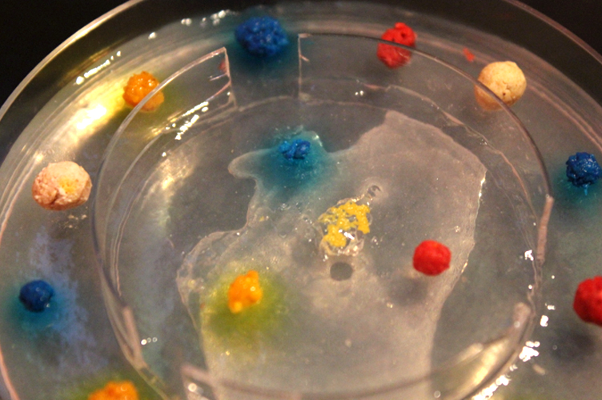
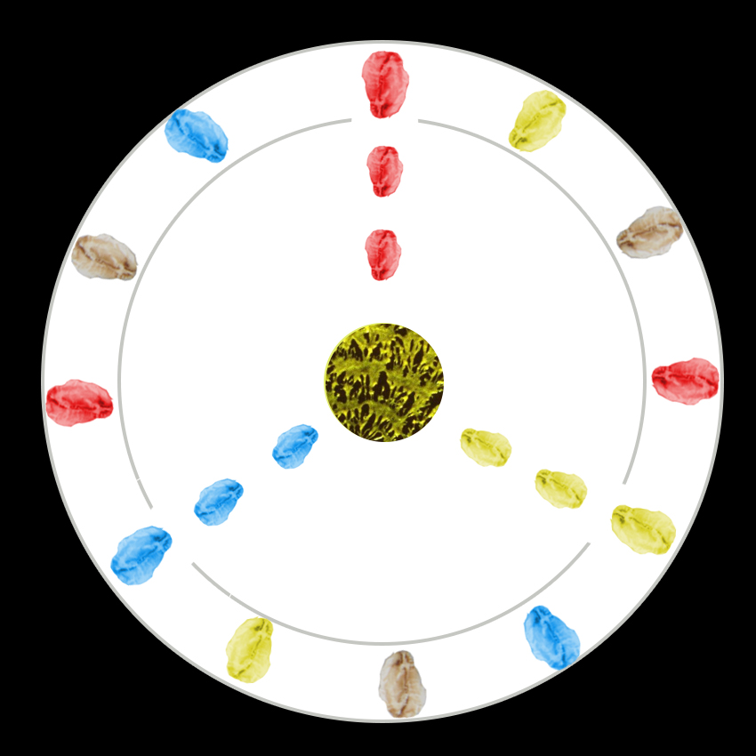
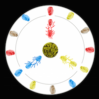
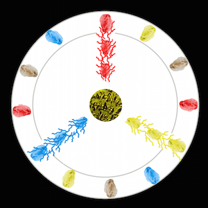
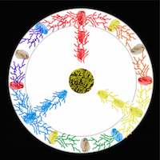
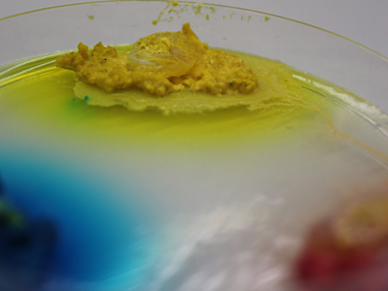
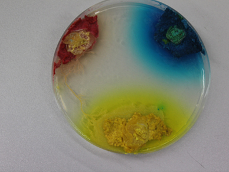
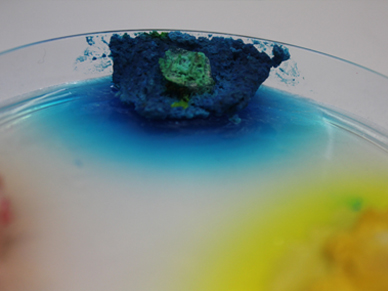
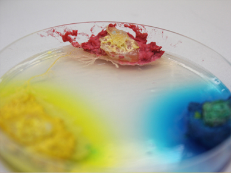

# Colourpicker

What is a slime mould?

Slime mould or slime mould is an informal name given to several kinds of unrelated eukaryotic organisms that can live freely as single cells, 
but aggregate together to form multicellular reproductive structures. 
Slime moulds were formerly classified as fungi but are no longer considered part of that kingdom. 
Although not related to one another, they are still sometimes grouped for convenience within the paraphyletic group referred to as kingdom Protista.
For more information click here : https://en.wikipedia.org/wiki/Slime_mold

# Exercise

We had the task to start any experiment with the slime mould witch might be interesting for working with open CV.
It was necessary to think about different conditions witch influence the behavour and the upgrowth of the slime mould. 
Somewhat we know about the slime mould. It seems to live on oat flakes and likes it dark.
For these experiments we used a raspberry pi with an additional cam to make constantly pictures of the happenings in the petri dish. On the basis of these pictures it was possible to create short stop motion movies witch helped to understand this impressing thing a bit more.

# Conceptual formulation

The first question I asked myself was : Can the slime mould change it`s colour? Or can it even mix colours.
So I decided to occupy the oat flakes with food colouring.

Here is my first experiment set-up with the results i had in mind

  
 

Unfortunately my real results look completely different:

https://vimeo.com/143471013

# Second try

This time I decided to remove the labyrinth and just take 3 dabs of colourized food.
On each dab I put a slime mould, hoping it will grow up and absorb the colour.

https://vimeo.com/143522971

# Abstract

This experiment did not work as I wanted but I still could extract some information. 
The food colour might not was the right colour.
In both experiments the blue coulor was not really attractive for the slime mould. It was more like he was avoiding it instead.
The red colour was quite similar.It did not destroy him, but the slime mould wanted to go to an other source of food which was much far away.
As you can see in the movie the only colour was yellow (which is actually it`s own colour) which was not avoided.
I think it was really interesting to work with this remarkable living thing. If I had more time for experiments like this I might have had results with more force of expression. 
All in all it was real fun. Thanks to Fabian Morón Zirfas for this innovative idea.

